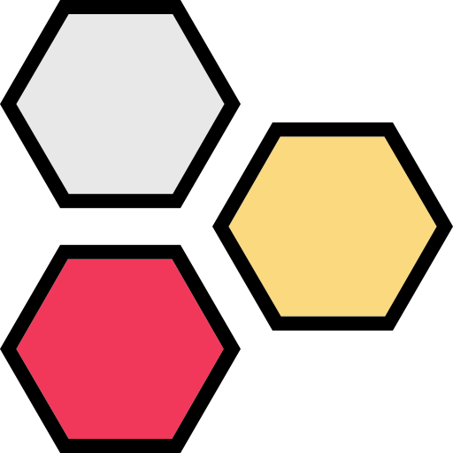

# react-hexgrid



React components that renders a fully adaptable grid of flat top hexagons using SVG. The
component will try to fill the container, properly adapting the size of the hexagons.

## Installation

`react-hexgrid` can be installed using [npm](https://npmjs.org/):

```
npm install --save react-hexgrid
```

## Basic usage

```javascript
import React from 'react';
import HexagonGrid from 'react-hexgrid';

const hexagons = [... //Put your content here];

React.render(
  <HexagonGrid
    containerWidth=300
    containerHeight=200
    hexagons={hexagons}
  />,
  document.getElementById('root')
);
```

## Props

* `containerWidth` -
* `containerHeight` -
* `hexagons` -
* `renderHexagon` -
* `hexProps` -

